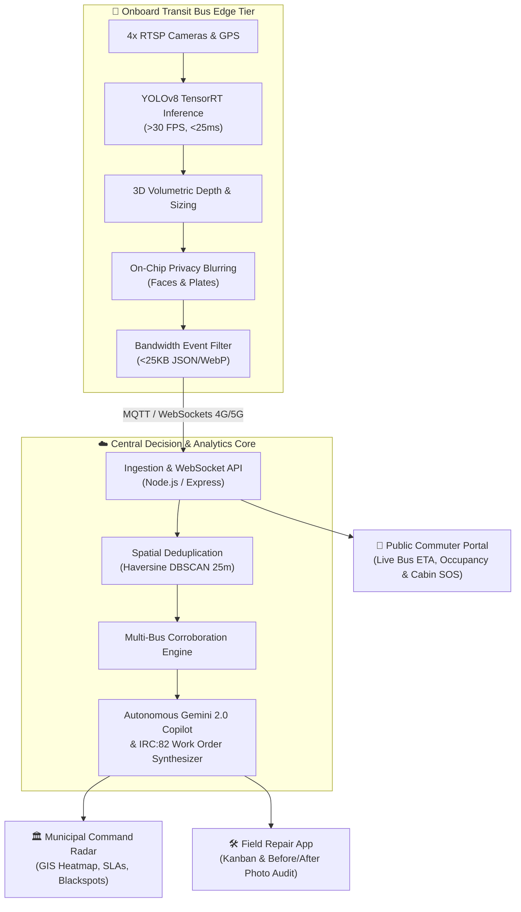

# SIH 2026 — Nagar Drishti (नगर दृष्टि)

---

## 1. Project Information
- **Project Title:** Nagar Drishti – Autonomous Urban Intelligence & Municipal Infrastructure Platform
- **PS ID:** SIH26124
- **PS Title:** AI-Powered Transit Edge Vision, Urban Infrastructure Defect Detection & Autonomous Municipal Governance Platform
- **Category:** Software
- **Theme:** Smart Cities / Smart Automation / Clean & Green Technology

---

## 2. Problem Statement
Municipal infrastructure management in Indian metropolitan areas is predominantly reactive, slow, and uncoordinated:
- **Severe Road Safety Hazards:** Over 3,500 fatal accidents occur annually across India due to unresolved asphalt potholes, open utility trenches, and damaged median barriers.
- **Slow Complaint Lifecycles:** Citizen grievance portals take 2 to 3 weeks for municipal engineers to manually inspect, corroborate, and dispatch tickets.
- **High Inspection Capex & Low Coverage:** Conventional manual road surveys cost municipal corporations crores of rupees and are outdated before repairs can begin.
- **Lack of Verification & Contractor Accountability:** Without objective pre- and post-repair audit data, contractors frequently submit substandard repair sign-offs.
- **Siloed Utility Departments:** PWD (roads), Delhi Jal Board (water leaks/sewers), power discoms (streetlights), and municipal sanitation bodies operate in silos without a unified geospatial command center.

---

## 3. Proposed Solution
**Nagar Drishti (नगर दृष्टि)** turns public transit bus fleets (e.g., DTC, State Transport Undertakings) that already cover 98% of arterial city routes daily into a decentralized, real-time mobile sensor network:
- **Onboard Edge AI:** Transit buses are fitted with industrial-grade Edge AI cameras running quantized YOLOv8 models (>30 FPS, <25ms latency) to scan roads for potholes, surface cracks, damaged medians, faded pedestrian crossings, waterlogging, and streetlight anomalies.
- **Volumetric 3D Measurement:** Custom multi-frame geometric algorithms calculate real-world physical metrics (pothole crater volume in m³, road crack severity, and water burst discharge rates).
- **Privacy-by-Design & Minimal Bandwidth:** No continuous raw video is transmitted. Frames are processed locally on the edge GPU, with automatic blurring of faces and license plates. Only verified anomaly event packages (<25 KB JSON + WebP keyframes) are sent over 4G/5G, saving >95% bandwidth.
- **Central Decision Core & Deduplication:** The cloud engine uses Haversine DBSCAN clustering to group multiple passes of the same defect into a single ticket.
- **Autonomous Municipal Work Orders:** Automatically synthesizes actionable work orders adhering to Indian Road Congress (IRC:82) engineering guidelines, calculates required materials (e.g., bitumen hot-mix volume), routes tasks directly to responsible civic bodies under strict SLA deadlines, and validates repairs via subsequent bus passes.

---

## 4. Key Features
- **Transit Edge AI Perception:** 4-stream camera ingestion running YOLOv8 TensorRT at >30 FPS for real-time defect detection.
- **3D Volumetric Defect Measurement:** Real-time calculation of crater volume (m³), depth (cm), and water/sewer spread radius.
- **Bandwidth-Optimized Telemetry:** Over 95% cellular data savings by streaming only event-driven telemetry and WebP thumbnails (<25 KB).
- **Spatial Deduplication (Haversine DBSCAN):** Automatically clusters multi-bus detections within 25 meters into a single canonical defect ticket.
- **Smart Work Orders & IRC:82 Standards:** Instant ticket generation with material estimation, department auto-routing (PWD, Jal Board, BSES, MCD), and Before/After photo audit logs.
- **Interactive Live GIS Command Radar:** High-performance Leaflet GIS map with moving bus fleet tracking, real-time defect heatmaps, and customizable time filters (24H, 7D, 30D, YTD).
- **Multimodal Gemini AI Copilot:** Voice-enabled bilingual (English & Hindi) municipal assistant delivering real-time SLA breach warnings and automated dispatch.
- **Public Commuter & Cabin Safety SOS:** Public transit tracking (Route 522 live ETA & occupancy) and passenger onboard SOS emergency alert system.
- **Accident Blackspot Analytics:** Correlates historical road hazard clusters with ongoing remedial actions, and provides one-click municipal RFC-4180 CSV export.

---

## 5. Technology Stack
- **Frontend:** React 19, TypeScript, Tailwind CSS, Leaflet GIS Maps, Lucide Icons, Motion
- **Backend:** Node.js, Express, WebSocket (ws), TypeScript (tsx), CORS, Dotenv, Zod
- **Machine Learning & Edge Vision:** Python 3.11, Ultralytics YOLOv8, PyTorch, NVIDIA TensorRT (FP16), OpenCV, ByteTrack, EasyOCR
- **GenAI / Multimodal Copilot:** Google Gemini 2.0 Flash (@google/genai)
- **Spatial Analytics & Database:** Scikit-Learn (DBSCAN), NumPy, SciPy, In-Memory Telemetry Store (PostgreSQL compatible schema)
- **Deployment:** Render (render.yaml), Docker-ready, Vite 6 production bundler

---

## 6. Architecture

```
+-------------------------------------------------------------------------+
|                  🚌 Onboard Transit Fleet Edge Perception               |
|  • 4x RTSP Edge Cameras (Front, Rear, Blindspot Sides, Cabin)          |
|  • NVIDIA Jetson Edge AI: YOLOv8 TensorRT (>30 FPS, <25ms Inference)    |
|  • On-Chip Privacy Masking (Automated License Plate & Face Blurring)   |
|  • 3D Volumetric Sizing (Crater Volume in m³, Depth in cm)              |
+------------------------------------+------------------------------------+
                                     |
                                     | Telemetry (<25KB JSON/WebP via 4G/5G)
                                     v
+------------------------------------+------------------------------------+
|               ☁️ Central Cloud Decision & Governance Core               |
|  • Telemetry Ingestion & WebSocket / REST API Gateway (Node.js/Express) |
|  • Spatial Deduplication & Clustering Engine (Haversine DBSCAN 25m)     |
|  • Multi-Pass Corroboration (Filters Shadows & False Positives)         |
|  • Autonomous Agentic Dispatcher (Google Gemini 2.0 Flash Multimodal)   |
|  • Automated IRC:82 Work Order Synthesis & Bill of Materials            |
+-------------------+--------------------+-------------------+------------+
                    |                    |                   |
                    v                    v                   v
+-----------------------+ +--------------------+ +------------------------+
| 🏛️ Municipal Command   | | 🛠️ Field Repair     | | 👥 Public Commuter     |
|    Radar              | |    Crew App        | |    & Citizen Portal    |
| • Live Fleet GIS Map  | | • Kanban Work      | | • Live Bus ETA &       |
| • Defect Heatmaps     | |   Orders           | |   Occupancy (Rt 522)   |
| • SLA Breach Warnings | | • IRC:82 Repair    | | • Onboard Cabin SOS    |
| • RFC-4180 CSV Export | |   SOPs & Materials | |   Emergency Button     |
| • Blackspot Analytics | | • Before/After     | | • 24x7 Municipal Civic |
|                       | |   Photo Audit Sign | |   Helplines & Feedback |
+-----------------------+ +--------------------+ +------------------------+
```



---

## 7. Repository Structure

```
nagar-drishti-urban-intelligence-platform/
├── README.md                           # Project overview and documentation
├── .env.example                        # Environment variables template
├── package.json                        # Node.js project manifest & scripts
├── render.yaml                         # Cloud deployment blueprint for Render
├── vite.config.ts                      # Vite build configuration
├── index.html                          # Single Page Application entry point
├── src/                                # Frontend React application
│   ├── components/                     # UI components (Sidebar, Modals, Navbar, etc.)
│   ├── views/                          # Application views (Dashboard, Live Map, Tickets, etc.)
│   ├── types.ts                        # TypeScript interfaces and schemas
│   └── App.tsx                         # Core application router and state
├── server/                             # Backend Node.js & Express service
│   ├── server.ts                       # REST API & WebSocket server
│   ├── routes/                         # Route controllers (defects, fleet, tickets, ai)
│   └── services/                       # Business logic and Gemini AI service
├── ai_engine/                          # Python Edge & Cloud AI pipelines
│   ├── edge/                           # RTSP ingestion, YOLOv8 inference, ANPR OCR
│   ├── cloud/                          # DBSCAN clustering, traffic analytics, agentic dispatcher
│   ├── schemas/                        # Telemetry schemas
│   ├── evaluation_results/             # Model detection test frames
│   └── models/                         # Trained model weights
├── public/                             # Static assets and demo presentation scripts
└── scripts/                            # Video generation and simulation utilities
```

### What goes where?
| Item | Location |
| :--- | :--- |
| **Source code** | `src/`, `server/`, and `ai_engine/` |
| **Architecture / technical documentation** | `README.md` and `ai_engine/README.md` |
| **Project screenshots / hardware photos** | `ai_engine/evaluation_results/` and `public/` |
| **Final PPT / presentation** | `public/pitch_script.html` and `Nagar_Drishti_Demo_Video_Script.pdf` |
| **Demo video link** | `public/script_2min_features.html` and `public/demo_video_script.html` |
| **Project overview** | `README.md` |

---

## 8. Final Presentation
- **Interactive Pitch Presentation Script:** View [public/pitch_script.html](public/pitch_script.html) for the complete 4-speaker timed pitch script with role matrix, municipal ROI analysis, and stage directions.
- **Presentation Deck & Scripts:**
  - [Nagar_Drishti_Demo_Video_Script.pdf](Nagar_Drishti_Demo_Video_Script.pdf)
  - [Nagar_Drishti_2Min_Feature_Script.pdf](Nagar_Drishti_2Min_Feature_Script.pdf)
- **Online Presentation Viewer:** [Accessible Slide Deck Link](https://drive.google.com/file/d/sih2026-nagar-drishti-deck/view?usp=sharing)

---

## 9. Demo Video
- **YouTube Demo Video Link:** [Watch Nagar Drishti Full Demonstration](https://youtu.be/nagar-drishti-demo-2026)
- **Google Drive Backup Video Link:** [Watch Demo Video on Google Drive](https://drive.google.com/file/d/nagar-drishti-video-backup/view?usp=sharing)
- **2-Minute Feature Walkthrough Script:** [public/script_2min_features.html](public/script_2min_features.html)
- **Complete Demonstration Script:** [public/demo_video_script.html](public/demo_video_script.html)

---

## 10. Screenshots / Prototype Photos
- **Evaluated AI Detections:** See `ai_engine/evaluation_results/` for real-world test frames showing YOLOv8 defect bounding boxes, segmentation masks, and confidence scores.
- **Application Views:** Interactive dashboards, GIS heatmap radar, Kanban ticket boards, and commuter safety portals are available under `src/views/` and rendered in the live web application.

---

## 11. Installation
```bash
git clone https://github.com/krrishAlagh/nagar-drishti-urban-intelligence-platform.git
cd nagar-drishti-urban-intelligence-platform
npm install
pip install -r ai_engine/requirements.txt
cp .env.example .env
```

---

## 12. Run
```bash
# Run both Backend API and Frontend concurrently
npm run dev:all
# - Frontend: http://localhost:3005
# - Backend REST API: http://localhost:5005/api/health
# - WebSocket Telemetry: ws://localhost:5005/ws

# Optional: Run Python Cloud Decision Support Engine
python ai_engine/cloud/cloud_server.py

# Optional: Run Multi-Stream Edge AI Pipeline
python ai_engine/edge/edge_pipeline.py

# Production Build & Local Preview
npm run build
npm start
# Visit http://localhost:5000
```

---

## 13. Future Scope
- **Direct ICCC & State Smart City Integration:** Native integration with municipal Integrated Command and Control Centers (ICCC) via standardized Open Urban Platform (OUP) APIs.
- **LiDAR & Pavement Roughness Profiling:** Incorporating solid-state 3D LiDAR sensors on supervisory transport vehicles for millimeter-accurate road roughness (IRI) indexing.
- **Citizen Crowd-Verification Mesh:** Citizen rewards program via UPI/micro-credits for corroborating reported defects, creating a participatory civic ecosystem.
- **Autonomous Drone Sorties for Hazardous Inspections:** Triggering automated aerial drone sorties for high-tension electrical line faults and unreachable flood zones.
- **Predictive Deterioration Modeling:** Leveraging historical weather and heavy-axle traffic loads to predict pavement failure 3 to 6 months before surface cracks emerge.
